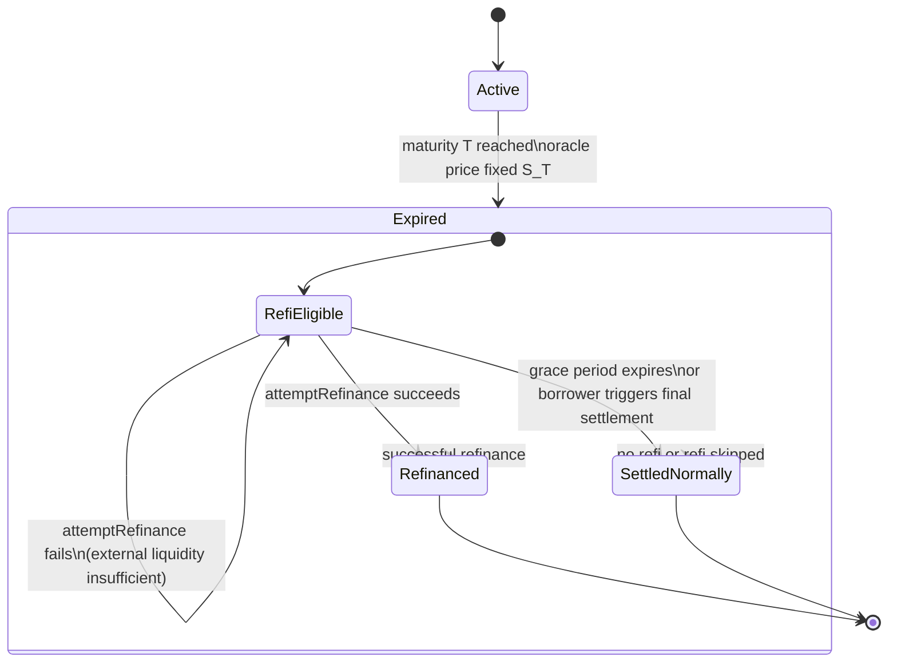

# Zero-cost collateralized loans on-chain

## Overview

This protocol enables fixed-maturity, non-recourse, BTC-backed on-chain loans using an RFQ model.  
Borrowers deposit BTC-like collateral and receive stablecoin liquidity from lenders.  
In exchange for cheaper or 0-interest financing, borrowers give up BTC upside above a call strike `K_call` (covered call payoff).  

Lenders may hedge their exposure off-chain using centralized option venues.  
The protocol does **not** enforce hedging or settlement of external instruments.  

## Key Loan Properties

- Fully on-chain collateral escrow
- No liquidations or margin calls before maturity
- Single oracle price read at or near maturity
- Deterministic settlement logic
- Non-recourse: borrower can walk away if collateral value < debt
- Borrower’s upside capped at `K_call` strike
- Optional refinance path in the middle-case settlement region to avoid collateral sale

Collateral liquidation is now used **only as a last resort**, and **only after a refinance attempt fails** (in eligible cases) or a refi grace window has expired.

---

## Parameters and Notation

Per-loan parameters:

| Symbol | Meaning |
|-------|---------|
| `C` | Collateral amount (BTC-like token units) |
| `P` | Principal disbursed at origination |
| `R` | Repayment amount owed at maturity (may equal `P` for 0% APR loans) |
| `T` | Maturity timestamp |
| `K_call` | Upside cap (call strike) |
| `S_T` | Oracle BTC/USD price read at/near maturity |
| `V` | Collateral value at maturity `V = C * S_T` |

A loan moves through a state machine at/after maturity to avoid single-call race conditions and MEV griefing.

---

## Loan State Machine



### State Definitions

- **Active** – loan live, collateral locked, no settlement allowed.
- **Expired (refi-eligible)** – loan past maturity, oracle price known, settlement amount determined, but collateral movement deferred while borrowers can try refinance.
- **Refinanced** – external refinancing succeeded, lender repaid, loan closed.
- **SettledNormally** – refinance attempts failed or were skipped; fallback to pure Design B settlement logic.

---

## Oracle Read

At the moment of first settlement-related action after `T` (e.g., entering `Expired` state via `expire()` or equivalent), the loan records a single oracle price `S_T`.  

This price determines all settlement outcomes.

Price requirements:

- Must come from a whitelisted oracle adapter
- Must be within freshness/staleness bounds
- If oracle unavailable, settlement delays until valid price exists

---

## Settlement Regions (determined once entering Expired)

Based on `V = C * S_T`:

### 1. Downside Region — No Refi Attempt
```

if V < R

```

- Loan is underwater.
- Non-recourse default.
- When settlement occurs:
  - **all collateral transferred to lender**
- No refinance attempt is allowed in this region.

---

### 2. Middle Region — Refinance First
```

if R ≤ V ≤ C * K_call

```

- Collateral value covers debt but not above upside cap.
- **Goal:** preserve borrower’s BTC exposure if feasible.
- When in this region:
  - Loan moves to `Expired (refi-eligible)`
  - Borrower or keeper may call `attemptRefinance()` any time before grace window ends

#### Refinance success conditions

- Via a whitelisted lending adapter (e.g., Aave/Morpho):
  1. BTC collateral `C` is deposited in external lending protocol
  2. Borrowing capacity is checked using protocol’s LTV/health rules
  3. Must be able to borrow at least `R` stablecoins at a **safe borrow limit**
     - may apply safety factor (< protocol max)
  4. Borrowed amount transferred on-chain to repay lender in full

- If successful:
  - Lender receives full repayment `R`
  - External lending position (BTC collateral + stable debt) assigned/transferred to borrower
  - Loan state transitions to `Refinanced` (final state)
  - **No BTC collateral is sold**

#### Refinance failure

A refi attempt does **not** finalize the loan if:

- borrowing power < `R`
- adapter call reverts
- insufficient liquidity in external protocol
- borrower opts out
- refi not enabled for this loan

If refi attempt reverts or returns insufficient capacity, the loan remains `Expired` and refi can be retried.

A **grace period** from expiry defines how long refi attempts may continue.  
If the period expires without successful refinance, `settleNormally()` may be invoked.

---

### 3. Upside Region — No Refi Attempt
```

if V > C * K_call

```

- Collateral value exceeds the upside cap.
- Borrower’s economic upside is capped at `C * K_call`
- No refi is attempted in this region, since borrower is already made whole economically.

Settlement transfers:

- BTC equivalent of `C * K_call − R` to borrower (in BTC terms)
- Remaining BTC value to lender

(Exact transfer mechanics defined separately.)

---

## Final Settlement Without Refinance (SettledNormally)

Triggered when:

- Refinance window expires, OR
- Borrower explicitly opts to settle immediately without refi

Behavior:

- Follow standard Design B settlement logic:
  - Sell BTC for stablecoins (via auction / RFQ / CowSwap)  
    **or**
  - Split collateral proportionally using oracle valuation  
    (implementation choice)
- Repay lender `R` (or give full collateral if `V < R`)
- Send borrower remaining BTC entitlement (if any)

---

## Security Considerations for Refinance Logic

To prevent MEV-induced griefing:

- Refinance attempts must not finalize the settlement if external liquidity is temporarily unavailable.
- Failed refi attempts must not push loan into liquidation state.
- Final settlement may only occur:
  - after grace period expires, or
  - borrower submits intent to finalize settlement

Thus draining external pools temporarily does not let an attacker force premature collateral sale.
